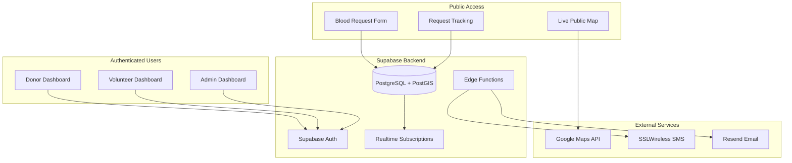
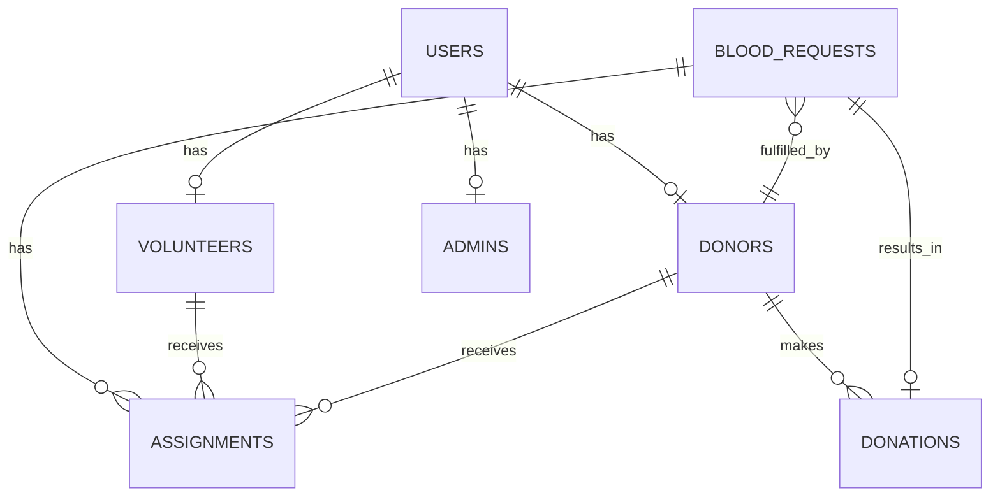
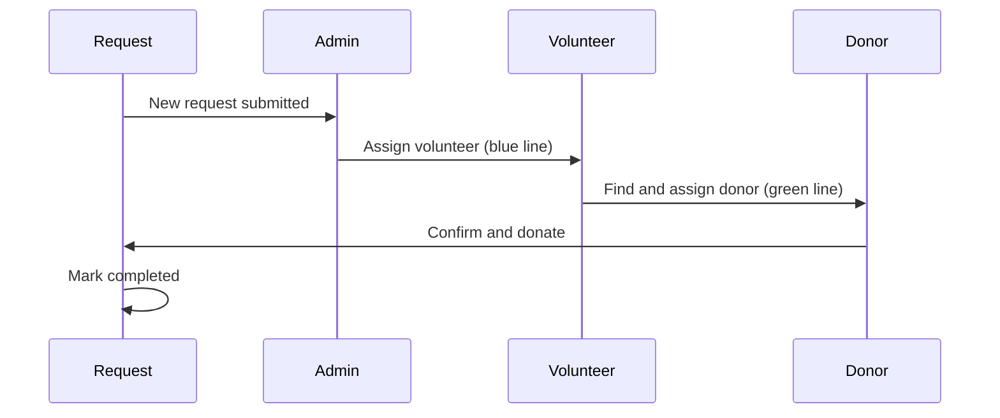

# Blood Donation Management System - Full Phase 1 MVP

## Architecture Overview




## Technology Stack

| Layer | Technology ||-------|------------|| Framework | Next.js 14+ (App Router) || UI | shadcn/ui + Tailwind CSS || Maps | @vis.gl/react-google-maps || Database | Supabase PostgreSQL + PostGIS || Auth | Supabase Auth || State | Zustand + React Context || Forms | React Hook Form + Zod || Data Fetching | TanStack Query || Language | Bengali (primary) + English |---

## Implementation Plan

### Phase 1: Project Foundation

**1.1 Initialize Next.js 14 Project**

- Create Next.js app with TypeScript, Tailwind CSS, and App Router
- Install and configure shadcn/ui components
- Set up project structure following best practices
- Configure environment variables template

**1.2 Database Schema Setup**

- Create Supabase migration files for all 13+ tables
- Enable PostGIS extension for geospatial queries
- Implement Row Level Security (RLS) policies
- Create database types for TypeScript



Key tables:

- `users` - Base user table (Supabase Auth)
- `donors` - Donor profiles with eligibility tracking
- `volunteers` - Volunteer profiles with performance metrics
- `admins` - Admin profiles
- `blood_requests` - All blood requests (public + registered)
- `assignments` - Two-level assignment tracking
- `donations` - Completed donation records
- `notifications` - Notification logs

### Phase 2: Core Public Features

**2.1 Public Blood Request Form** (`/request-blood`)

- Location picker with interactive map
- Auto-detect current location option
- Blood group selection with compatibility info
- Patient details form with validation
- Emergency detection (needed within 6 hours)
- reCAPTCHA integration (mock for now)
- Tracking ID generation (BLD-YYYYMMDD-XXXX)

**2.2 Public Request Tracking** (`/track/[trackingId]`)

- Real-time status updates via Supabase Realtime
- Progress timeline visualization
- SMS/Email confirmation (mock implementation)
- Status stages: Submitted -> Approved -> Volunteer Assigned -> Donor Assigned -> Donor Confirmed -> Completed

**2.3 Public Live Map** (`/live-map`)

- Display active blood requests (color-coded by urgency)
- Filter by blood group
- Blood demand heatmap
- Sanitized info only (no personal data)

### Phase 3: Authentication and Dashboards

**3.1 Authentication System**

- Supabase Auth integration
- Role-based access (donor, volunteer, admin)
- Phone/Email login
- Protected route middleware

**3.2 Donor Dashboard** (`/dashboard/donor`)

- Profile management
- Availability toggle
- Assigned requests view
- Donation history
- Eligibility status (next donation date)
- Interactive map showing assigned requests

**3.3 Volunteer Dashboard** (`/dashboard/volunteer`)

- Assigned requests list
- Donor search with map
- One-click donor assignment
- Performance metrics
- Request management interface

**3.4 Admin Dashboard** (`/dashboard/admin`)

- All requests overview
- Request approval workflow
- Volunteer assignment interface
- Analytics and statistics
- User management
- Complete map with all data

### Phase 4: Map System

**4.1 Map Components Architecture**

- Shared map component with role-based rendering
- Real-time marker updates
- Assignment line visualization (blue for volunteer, green for donor)
- Clustering for dense areas

**4.2 Role-Specific Map Views**| Role | Features ||------|----------|| Public | Active requests, urgency colors, heatmap || Donor | Own location, assigned requests, route/ETA || Volunteer | Assigned requests, available donors, assignment UI || Admin | All entities, both assignment types, analytics |

### Phase 5: Assignment System

**5.1 Two-Level Assignment Workflow**



**5.2 Smart Matching Algorithm**

- Distance calculation using PostGIS
- Blood group compatibility checking
- Eligibility verification
- Scoring system with weighted factors

### Phase 6: Notification System

**6.1 Notification Service** (Mock Implementation)

- SMS gateway abstraction (SSLWireless ready)
- Email service abstraction (Resend ready)
- In-app notification system
- Notification templates in Bengali/English

**6.2 Notification Triggers**

- New request confirmation
- Assignment notifications
- Status updates
- Emergency alerts
- Donation reminders

### Phase 7: Real-time Features

**7.1 Supabase Realtime Channels**

- `public:blood_requests` - New request broadcasts
- `map:markers` - Real-time marker updates
- `assignments:volunteer:{id}` - Volunteer tasks
- `assignments:donor:{id}` - Donor tasks
- `requests:tracking:{tracking_id}` - Public tracking

---

## Project Structure

```javascript
src/
├── app/
│   ├── (public)/
│   │   ├── page.tsx                    # Landing page
│   │   ├── request-blood/page.tsx      # Public request form
│   │   ├── track/[trackingId]/page.tsx # Public tracking
│   │   └── live-map/page.tsx           # Public map
│   ├── (auth)/
│   │   ├── login/page.tsx
│   │   └── register/page.tsx
│   ├── dashboard/
│   │   ├── donor/page.tsx
│   │   ├── volunteer/page.tsx
│   │   └── admin/page.tsx
│   ├── api/
│   │   ├── public/
│   │   ├── donor/
│   │   ├── volunteer/
│   │   └── admin/
│   └── layout.tsx
├── components/
│   ├── ui/                  # shadcn components
│   ├── maps/                # Map components
│   ├── forms/               # Form components
│   └── dashboard/           # Dashboard components
├── lib/
│   ├── supabase/           # Supabase client + types
│   ├── services/           # Business logic
│   └── utils/              # Utilities
├── hooks/                   # Custom hooks
├── stores/                  # Zustand stores
└── types/                   # TypeScript types
```

---

## Key Implementation Files

1. **Database Migrations**: `supabase/migrations/` - Complete schema with PostGIS
2. **Supabase Client**: `src/lib/supabase/client.ts` - Browser/server clients
3. **Map Components**: `src/components/maps/BloodMap.tsx` - Role-based map
4. **Request Form**: `src/components/forms/BloodRequestForm.tsx`
5. **Assignment Service**: `src/lib/services/assignment.ts`
6. **Notification Service**: `src/lib/services/notifications.ts` (mock)

---

## Mock Services Note

Since no API keys are available yet, these services will have mock implementations:

- **Google Maps**: Will use placeholder map with simulated markers
- **SMS (SSLWireless)**: Will log to console and store in database
- **Email (Resend)**: Will log to console and store in database
- **reCAPTCHA**: Will bypass in development mode

All mocks are designed for easy replacement with real implementations when API keys are available.---

## Estimated Deliverables

- 50+ React components
- 15+ API routes
- 13+ database tables
- 4 role-based dashboards
- Real-time map system