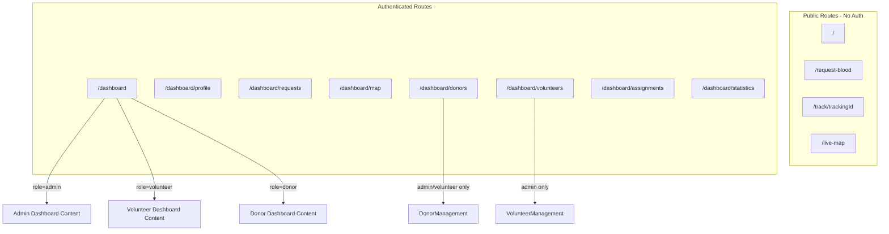

#Unified Dashboard Architecture Refactor

## Current State Analysis

The codebase currently has:

- **Separate dashboard routes**: `/dashboard/admin/*`, `/dashboard/donor/page.tsx`, `/dashboard/volunteer/page.tsx`
- **Two layouts**: [`src/app/dashboard/layout.tsx`](src/app/dashboard/layout.tsx) (general) and [`src/app/dashboard/admin/layout.tsx`](src/app/dashboard/admin/layout.tsx) (admin-specific)
- **Redirect page**: [`src/app/dashboard/page.tsx`](src/app/dashboard/page.tsx) redirects to role-specific routes
- **Database**: Comprehensive schema with profiles, donors, volunteers, blood_requests, assignments, donations tables

## Target Architecture



---

## Phase 1: Routing Refactor

### 1.1 Delete Separate Dashboard Routes

Remove the role-specific dashboard folders and consolidate into unified routes:

- Delete `src/app/dashboard/admin/` (move admin-specific pages to shared routes)
- Delete `src/app/dashboard/donor/`
- Delete `src/app/dashboard/volunteer/`

### 1.2 Create Unified Dashboard Structure

New route structure under `src/app/dashboard/`:| Route | Access | Description ||-------|--------|-------------|| `/dashboard` | All authenticated | Main dashboard (role-based content) || `/dashboard/profile` | All | User profile page || `/dashboard/requests` | All | Blood requests (filtered by role) || `/dashboard/map` | All | Interactive map (role-based layers) || `/dashboard/donors` | Admin + Volunteer | Donor management || `/dashboard/volunteers` | Admin only | Volunteer management || `/dashboard/assignments` | Admin + Volunteer | Assignment management || `/dashboard/statistics` | All | Analytics (role-based metrics) |

### 1.3 Update Layout with Role-Based Sidebar

Modify [`src/app/dashboard/layout.tsx`](src/app/dashboard/layout.tsx):

- Fetch user role from `/api/auth/me` endpoint
- Pass role to a new `<RoleBasedSidebar>` component
- Sidebar renders different menu items based on role

---

## Phase 2: Component Architecture

### 2.1 Create Role-Based Components

Create new components in `src/components/dashboard/`:

```javascript
src/components/dashboard/
├── RoleBasedSidebar.tsx      # Dynamic sidebar based on role
├── AdminDashboard.tsx        # Admin dashboard content
├── VolunteerDashboard.tsx    # Volunteer dashboard content
├── DonorDashboard.tsx        # Donor dashboard content
├── RoleGate.tsx              # Component to hide content by role
└── useUserRole.ts            # Hook to get current user role
```


### 2.2 Sidebar Menu Configuration

```typescript
const menuConfig = {
  admin: [
    { href: "/dashboard", label: "Dashboard", icon: Home },
    { href: "/dashboard/requests", label: "All Requests", icon: ClipboardList },
    { href: "/dashboard/donors", label: "Donors", icon: Users },
    { href: "/dashboard/volunteers", label: "Volunteers", icon: UserCheck },
    { href: "/dashboard/assignments", label: "Assignments", icon: Link },
    { href: "/dashboard/map", label: "Map View", icon: MapPin },
    { href: "/dashboard/statistics", label: "Analytics", icon: BarChart },
    { href: "/dashboard/settings", label: "Settings", icon: Settings },
  ],
  volunteer: [
    { href: "/dashboard", label: "Dashboard", icon: Home },
    { href: "/dashboard/requests", label: "My Requests", icon: ClipboardList },
    { href: "/dashboard/donors", label: "Donors", icon: Users },
    { href: "/dashboard/assignments", label: "Assignments", icon: Link },
    { href: "/dashboard/map", label: "Map View", icon: MapPin },
    { href: "/dashboard/statistics", label: "My Stats", icon: BarChart },
  ],
  donor: [
    { href: "/dashboard", label: "Dashboard", icon: Home },
    { href: "/dashboard/requests", label: "Assigned Requests", icon: ClipboardList },
    { href: "/dashboard/map", label: "Map View", icon: MapPin },
    { href: "/dashboard/statistics", label: "My History", icon: BarChart },
    { href: "/dashboard/profile", label: "Profile", icon: User },
  ],
};
```

---

## Phase 3: Middleware Protection

Update [`src/middleware.ts`](src/middleware.ts) for role-based route protection:

```typescript
const routePermissions = {
  "/dashboard/volunteers": ["admin"],
  "/dashboard/donors": ["admin", "volunteer"],
  "/dashboard/assignments": ["admin", "volunteer"],
  "/dashboard/settings": ["admin"],
  "/dashboard": ["admin", "volunteer", "donor"],
};
```

---

## Phase 4: Test Account Creation

Use Supabase to create test accounts:| Type | Count | Email Pattern | Password ||------|-------|---------------|----------|| Admin | 1 | admin@blooddonation.org | Admin@123 || Volunteer | 4 | volunteer{1-4}@blooddonation.org | Volunteer@123 || Donor | 20 | donor{1-20}@blooddonation.org | Donor@123 |Blood group distribution for donors:

- A+: 5, B+: 5, O+: 4, AB+: 2, A-: 1, B-: 1, O-: 1, AB-: 1

---

## Phase 5: Blood Request System

### 5.1 Public Blood Request Form

Verify [`src/app/(public)/request-blood/page.tsx`](src/app/\\\(public)/request-blood/page.tsx) works with:

- Form submission to `/api/public/request-blood`
- Tracking ID generation
- Location picker (Mapbox integration)

### 5.2 Create 10 Test Blood Requests

Create requests programmatically via API with varied:

- Blood groups (A+, B+, O+, AB+, O-)
- Urgency levels (critical, urgent, normal)
- Locations (Dhaka, Chittagong, Sylhet)

---

## Phase 6: Remove Mock Data

Search and replace mock data in:

- [`src/app/dashboard/layout.tsx`](src/app/dashboard/layout.tsx) - Line 36-42 has `mockUser`
- Dashboard page components
- Replace with real Supabase queries using service role for admin views

---

## Phase 7: Testing

Write tests in `__tests__/` directory:

- `auth.test.ts` - Login redirects to `/dashboard` for all roles
- `role-access.test.ts` - Role-based route protection
- `blood-request.test.ts` - Public form submission
- `assignment.test.ts` - Two-level assignment system

---

## Implementation Order

1. Create role-based components first (sidebar, dashboard content)
2. Refactor layout to use new components
3. Update middleware for route protection
4. Delete old separate dashboard routes
5. Create test accounts
6. Create test blood requests
7. Remove all mock data
8. Write and run tests
9. Fix any bugs found

---

## Key Files to Modify

| File | Change ||------|--------|| `src/app/dashboard/layout.tsx` | Replace with role-based sidebar || `src/app/dashboard/page.tsx` | Render role-based dashboard component || `src/middleware.ts` | Add route permission checks || `src/app/dashboard/requests/page.tsx` | Create unified requests page || `src/app/dashboard/donors/page.tsx` | Create unified donors page || `src/app/dashboard/volunteers/page.tsx` | Create unified volunteers page || `src/app/dashboard/map/page.tsx` | Create unified map page |---

## Success Criteria

- All users land on `/dashboard` after login (same URL)
- Sidebar shows different menu items based on role
- Admin can access all routes
- Volunteer cannot access `/dashboard/volunteers`
- Donor cannot access `/dashboard/donors` or `/dashboard/volunteers`
- No mock data remains in codebase